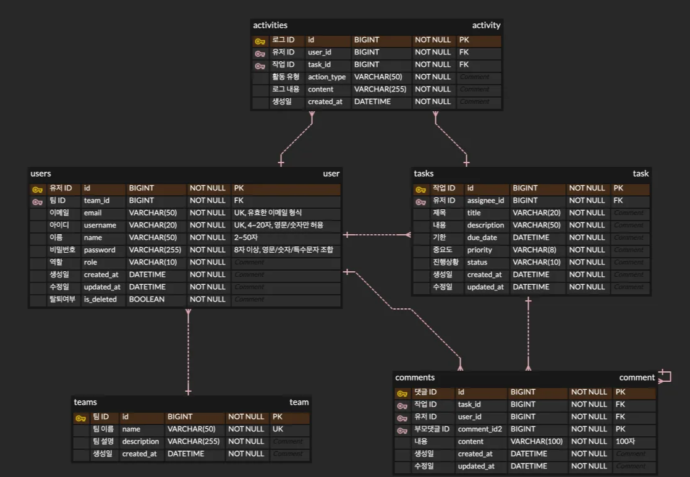

# 내일배움캠프 아웃소싱 프로젝트 
> - CH4. 주특기 심화 주차
> - **팀명** : 뉴구 🆕9️⃣ <br>
> - **목표**: 외주(아웃소싱) 개발 협업을 위한 **일관된 API 계약서**와 **실행 가이드**를 제공하여, 프론트엔드/백엔드와의 협업을 빠르게 배워볼 수 있는 과제입니다.

<div align="center">

## 기술 스택 Tech Stack
<!-- Java -->


<!-- Docker -->


<!-- MySQL -->


<!-- Gradle -->


<!-- Spring Boot -->


<!-- JWT -->


<!-- JPA (Hibernate 로고 사용) -->


<!-- GitHub -->


</div>

---

## 목차
- [프로젝트 개요](#-프로젝트-개요)
- [기술 스택](#-기술-스택)
- [보안 & 인증](#-보안--인증)
- [유효성 검사 규칙](#-유효성-검사-규칙)
- [ERD](#-ERD)
- [API 명세](#-API-명세)
    - [팀 TEAM](#TEAM)
    - [사용자 USER](#USER)
    - [작업 TAKS](#TASK)
    - [댓글 COMMENT](#COMMENT)
    - [대시보드 DASHBOARD ](#DASHBOARD)
    - [활동 로그 ACTIVITY](#ACTIVITY)
- [버전 관리 & 변경 이력](#-버전-관리--변경-이력)
- [기여 가이드](#-기여-가이드)

---

## 프로젝트 개요
TaskFlow는 인증/작업/댓글/팀 관리/활동 로그/대시보드/검색으로 구성된 협업용 업무 관리 백엔드입니다. 모든 API는 **일관된 응답 스키마**를 따르며, 인증은 **JWT Bearer**를 사용합니다.

---

## 기술 스택
- **Backend**: Spring Boot, Java 17+, JPA/Hibernate, Validation
- **Auth**: JWT (Bearer Token)
- **DB**: MySQL
- **Build**: `build.gradle`, `application.yml`
- **Docs**: Markdown (README)

---
## 보안 인증

---
## 유효성 검사 규칙

---
## ERD


---

## API-명세
### [TEAM]
| 기능             | HTTP Method | Endpoint URI                           | 설명                          |
|------------------------------|-------------|----------------------------------------|-----------------------------|
| 팀 생성           | `POST`   | `/api/teams`                           | 새로운 팀을 생성합니다.               |
| 팀 목록 조회         | `GET`    | `/api/teams`                           | 내가 속한 팀 목록을 조회합니다.          |
| 특정 팀 조회         | `GET`    | `/api/teams/{teamId}`                  | 특정 팀의 상세 정보를 조회합니다.         |
| 팀 정보 수정         | `PUT`    | `/api/teams/{teamId}`                  | 특정 팀의 정보를 수정합니다.            |
| 팀 삭제           | `DELETE`  | `/api/teams/{teamId}`                  | 특정 팀을 삭제합니다.                |
| 팀 멤버 추가         | `POST`   | `/api/teams/{teamId}/members`          | 특정 팀에 멤버를 초대합니다.            |
| 팀 멤버 제거         | `DELETE`  | `/api/teams/{teamId}/members/{userId}` | 특정 팀에서 멤버를 제거합니다.           |
| 팀 멤버 목록 조회      | `GET`    | `/api/teams/{teamId}/members`          | 특정 팀의 멤버 목록을 조회합니다.         |
| 추가 가능한 사용자 목록 조회 | `GET`    | `/api/users/available?teamId={teamId}` | 해당 팀에 추가 가능한 사용자 목록을 조회합니다. |

### [USER]
| 기능        | HTTP Method | Endpoint URI         | 설명                         |
|--------------------|-------------|----------------------|----------------------------|
| 회원가입      | `POST`   | `/api/auth/register` | 새로운 사용자를 등록합니다.            |
| 로그인       | `POST`   | `/api/auth/login`    | 사용자 인증 후 JWT를 발급합니다.       |
| 회원탈퇴      | `DELETE`  | `/api/auth/withdraw` | 현재 로그인된 사용자를 탈퇴 처리합니다.     |
| 내 정보 조회    | `GET`    | `/api/users/me`      | 현재 로그인된 사용자의 정보를 조회합니다.    |
| 사용자 목록 조회  | `GET`    | `/api/users`         | 팀 초대를 위한 사용자 목록을 조회합니다.    |

### [TASK]
| 기능       | HTTP Method | Endpoint URI                                                   | 설명                         |
|------------------|-------------|----------------------------------------------------------------|-------------------------------------------------------|
| Task 생성    | `POST`   | `/api/tasks`                                                   | 새로운 Task를 생성합니다.               |
| Task 목록 조회  | `GET`    | `/api/tasks?status=TODO&page=0&size=10&search=기획&assigneeId=1` | 조건부로 Task 목록을 조회합니다.           |
| Task 상세 조회  | `GET`    | `/api/tasks/{taskId}`                                          | 특정 Task의 상세 정보를 조회합니다.          |
| Task 수정    | `PUT`    | `/api/tasks/{taskId}`                                          | 특정 Task의 정보를 수정합니다.            |
| Task 상태 변경  | `PATCH`   | `/api/tasks/{taskId}/status`                                   | 특정 Task의 상태를 변경합니다.            |
| Task 삭제    | `DELETE`  | `/api/tasks/{taskId}`                                          | 특정 Task를 삭제합니다.                |

### [COMMENT]
| 기능       | HTTP Method | Endpoint URI                                              | 설명                               |
|------------------|-------------|-----------------------------------------------------------|-------------------------------------------------------------------|
| 댓글 생성    | `POST`   | `/api/tasks/{taskId}/comments`                            | 특정 Task에 댓글 또는 대댓글을 생성합니다.            |
| 댓글 목록 조회  | `GET`    | `/api/tasks/{taskId}/comments?page=0&size=10&sort=newest` | 특정 Task의 댓글 목록을 계층적으로 조회합니다.          |
| 댓글 삭제    | `DELETE`  | `/api/tasks/{taskId}/comments/{commentId}`                | 특정 댓글과 하위 대댓글들을 삭제합니다.              |

### [DASHBOARD]
| 기능         | HTTP Method | Endpoint URI                               | 설명                         |
|----------------------|-------------|--------------------------------------------|-------------------------------------------------------|
| 대시보드 통계 조회  | `GET`    | `/api/dashboard/stats`                     | 대시보드 KPI 통계 정보를 조회합니다.         |
| 내 작업 요약 조회  | `GET`    | `/api/dashboard/my-tasks`                  | 대시보드의 내 작업 목록을 조회합니다.        |
| 통합 검색      | `GET`    | `/api/search`                              | 키워드로 Task, User, Team을 통합 검색합니다.     |
| 최근 활동 조회    | `GET`    | `/api/dashboard/activities?page=0&size=10` | 최근 활동을 조회합니다.               |
| 팀 진행률 조회    | `GET`    | `/api/dashboard/team-progress`             | 팀별 진행률을 조회합니다.              |
| 주간 작업 추세 조회 | `GET`    | `/api/dashboard/weekly-trend`              | 주간 작업 추세를 조회합니다.             |

### [ACTIVITY]
| 기능          | HTTP Method | Endpoint URI                                                                                                 | 설명                               |
|------------------------|-------------|--------------------------------------------------------------------------------------------------------------|-------------------------------------------------------------------|
| 활동 로그 조회     | `GET`    | `/api/activities?page=0&size=10&type=TASK_CREATED&userId=1&taskId=1&startDate=2025-09-09&endDate=2025-09-09` | 활동 로그를 조건부/페이지네이션 조회합니다.           |
| 통합 검색       | `GET`    | `/api/search?q={query}`                                                                                      | 검색어를 통해 통합 검색 결과를 조회합니다.            |
| 작업 검색 (페이징)   | `GET`    | `/api/tasks/search?q={query}&page=0&size=10`                                                                 | 작업 검색 결과를 페이지네이션 조회합니다.             |

---

## 버전 관리 변경 이력
### [1] 커밋 규칙
feat: 새로운 기능 추가 <BR>
fix: 버그 수정<BR>
docs: 문서 변경(README, 주석 등)<BR>
style: 포맷/세미콜론/공백 등에 동작에 영향이 없는 변경 또는 수정<BR>
refactor: 구조 개선, 이름 변경, 타입 변경<BR>
del: 쓸모 없는 코드 혹은 파일 삭제<BR>
move: 프로젝트 파일 및 코드 이동<BR>
rename: 파일 이름 변경<BR>
merge: 다른 브랜치와의 충돌 해결 후 Merge<BR>
perf: 메모리 등 성능 개선<BR>
test: 테스트 추가 / 개선 (테스트 코드 배우면 활용?)<BR>
build: 빌드 수정 / 의존성 수정(gradle, yml 등)
<BR>
chore: 자잘한 수정이나 빌드 / 의존성 업데이트
revert: 커밋 되돌리기

---

### [1-1] 커밋메세지 작성 규칙

- [브랜치명] feat: ~구현, 수정, merge
- 예시:
    - [auth] feat: 인증인가 구현
    - [auth] fix: ~오류 수정
    - [all] style: 불필요한 임포트문 삭제

---

### [1-2] 커밋 규칙
- 작성한 코드 스타일 정리(예: 정렬, 개행 등) 후 커밋하기!

### [2] 브랜치 규칙
- 각자 작업하는 부분은 꼭 브랜치 만들어서 작업!
- 먼저 dev에 PR!!!! main에 merge하지않기!!!! main에 push한다면 무조건 PR

  → PR 올린 후 팀원들에게 PR 소식 공유하기!!!!

---

## [2-1] 브랜치명 작성 규칙

- 최지나 : feat/auth, feat/user
- 김병수 : feat/team_member
- 박소영 : feat/comment
- 이지호 : feat/activity
- 김진희 : feat/team_info
- 이현경 : feat/task
- 이훈영 : feat/dashboard, feat/search

---

## 기여 가이드
### [깃허브 PR 규칙]
```
## #️⃣ Issue Number<!--- ex) #이슈번호, #이슈번호 -->

## 📝 요약(Summary)<!--- 변경 사항 및 관련 이슈에 대해 간단하게 작성해주세요. 어떻게보다 무엇을 왜 수정했는지 설명해주세요. -->

## 🛠️ PR 유형

어떤 변경 사항이 있나요?

- [ ] 새로운 기능 추가
- [ ] 버그 수정
- [ ] CSS 등 사용자 UI 디자인 변경
- [ ] 코드에 영향을 주지 않는 변경사항(오타 수정, 탭 사이즈 변경, 변수명 변경)
- [ ] 코드 리팩토링
- [ ] 주석 추가 및 수정
- [ ] 문서 수정
- [ ] 테스트 추가, 테스트 리팩토링
- [ ] 빌드 부분 혹은 패키지 매니저 수정
- [ ] 파일 혹은 폴더명 수정
- [ ] 파일 혹은 폴더 삭제

## 📸스크린샷 (선택)## 💬 공유사항 to 리뷰어<!--- 리뷰어가 중점적으로 봐줬으면 좋겠는 부분이 있으면 적어주세요. -->
<!--- 논의해야할 부분이 있다면 적어주세요.-->
<!--- ex) 메서드 XXX의 이름을 더 잘 짓고 싶은데 혹시 좋은 명칭이 있을까요? -->

## ✅ PR Checklist

PR이 다음 요구 사항을 충족하는지 확인하세요.

- [ ] 커밋 메시지 컨벤션에 맞게 작성했습니다.
- [ ] 변경 사항에 대한 테스트를 했습니다.(버그 수정/기능에 대한 테스트).
```
--- 
> 뉴구 고생하셨습니다! (●´ϖ`●)  (>ω<) 